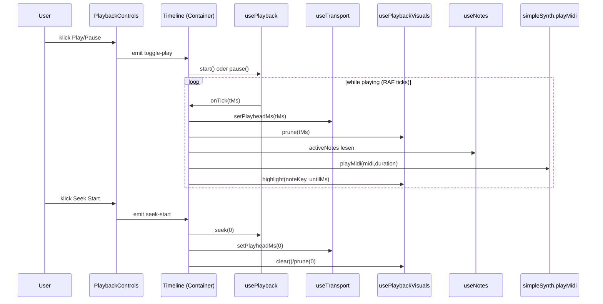

# Komponenten-Diagramm (GuitarJemp)

Dieses Dokument zeigt, wie die wichtigsten Komponenten/Stores/Composables zusammenarbeiten und welche Aufgaben sie haben.

> Tipp: VS Code rendert Mermaid-Diagramme in Markdown (oder via Mermaid-Extension).

## Bilder (SVG)

- Komponentenübersicht (SVG): [docs/component-diagram.svg](component-diagram.svg)
- Playback-Flow (SVG): [docs/playback-sequence.svg](playback-sequence.svg)

## 1) High-Level: UI → State → Domain

```mermaid
flowchart LR
  App[App.vue\n(App Shell)]

  subgraph UI[UI-Komponenten]
    FBEdit[FretboardEdit\n(Töne auswählen/ändern)]
    FBShow[FretboardShow\n(Anzeige + Playback-Visuals)]
    TL[Timeline\n(Container/Orchestrator)]
    TLView[TimelineView\n(Presentational)]
    TLC[PlaybackControls\n(Play/Pause, Seek Start, Loop)]
    TLM[ModeSelector\n(Snap, Sound, Beat, Zoom)]
    TLGrid[TimelineGrid\n(Head/Grid)]
    TLTrack[TimelineTrack\n(Track + Scrub)]
    Note[NoteEvent\n(Drag/Resize)]
    ATW[ActiveTonesWindow\n(Aktive Töne)]
  end

  subgraph State[Pinia Stores]
    Notes[useNotes\n(Noten: gridIndex,length,color...)]
    Sel[useSelection\n(selectedNoteKey, Auswahl)]
    Transport[useTransport\n(playState, playheadMs, tempo)]
    Settings[useTimelineSettings\n(snap,sound,loop,zoom,...)]
    Visuals[usePlaybackVisuals\n(highlight,pulse)]
    Instr[useInstrument\n(tuningId,numStrings,...)]
  end

  subgraph Logic[Composables]
    Playback[usePlayback\n(RAF Clock + seek/start/pause)]
    Grid[useGrid\n(timePerBlock, helpers)]
  end

  subgraph Domain[Domain / Audio / Music]
    Tunings[getTuning()]
    Pitch[midiForNote()]
    NotesName[midiToNoteName()]
    Synth[playMidi()]
  end

  App --> FBEdit
  App --> FBShow
  App --> TL
  App --> ATW

  TL --> TLView
  TLView --> TLC
  TLView --> TLM
  TLView --> TLGrid
  TLView --> TLTrack
  TLTrack --> Note

  %% State wiring
  FBEdit <--> Notes
  FBEdit <--> Sel
  FBEdit <--> Settings

  FBShow --> Notes
  FBShow --> Visuals
  FBShow --> Transport
  FBShow --> Instr

  TL --> Notes
  TL --> Settings
  TL --> Transport
  TL --> Visuals
  TL --> Instr

  %% Logic wiring
  TL --> Playback
  TL --> Grid

  %% Domain wiring
  TL --> Tunings
  TL --> Pitch
  TL --> Synth
  Note --> NotesName
  Note --> Pitch
  Note --> Synth
```

## 2) Aufgaben der zentralen Bausteine (kurz)

- **App.vue**: Layout/Shell, Modus-Umschaltung (Editor/Show), platziert Timeline + Fretboard + ActiveTones.
- **Timeline (Container)**: Orchestriert Playback (Clock), Playhead, Looping, Audio-Triggering, und setzt Store-State.
- **TimelineView**: Reine Darstellung/Komposition der Timeline-UI; leitet Events hoch.
- **PlaybackControls**: UI-Buttons/Controls für Play/Pause und „Seek Start“ + Loop.
- **ModeSelector**: UI für Snap/Sound/Beat/Zoom.
- **TimelineTrack**: Rendert einen Track; erlaubt Scrubbing/Seek via Pointer.
- **NoteEvent**: Rendert einzelne Note; Drag/Resize; (optional) Sound-Preview.
- **FretboardEdit**: Bearbeiten/Auswählen der Töne/Noten.
- **FretboardShow**: Zeigt ausgewählte Noten + Playback-Visuals (Opacity/Highlight/Pulse).

## 3) Playback-Flow (Sequenz)



## 4) Zoom/Scroll-Konzept (Timeline)

- **Zoom**: `zoomPxPerBlock` (px/Block) bestimmt die Mindestbreite des Track-Inhalts: `minWidth = totalBlocks * zoomPxPerBlock`.
- **Horizontal scroll**: Wenn `minWidth` größer als Viewport, wird der Timeline-Bereich horizontal scrollbar.
- **Sticky Labels**: Saiten-Labels bleiben links sichtbar, während der Inhalt scrollt.
