# Komponenten-Diagramm (GuitarJemp)

Aktueller Stand der strukturellen Abhaengigkeiten im Projekt.

## Komponentendiagramm

```mermaid
flowchart TB
  App[App.vue]
  WM[WindowManager.vue]

  subgraph UI["UI-Komponenten"]
    FB[FretboardView.vue]
    TL[Timeline/index.js Container]
    TLV[TimelineView.vue]
    TT[TimelineTrack.vue]
    NE[NoteEvent.vue]
    TB[TransportBar.vue]
    PC[PlaybackControls.vue]
  end

  subgraph Stores["Pinia Stores"]
    SNotes[useNotes]
    SSel[useSelection]
    STransport[useTransport]
    SSettings[useTimelineSettings]
    SInstr[useInstrument]
    SVisuals[usePlaybackVisuals]
    SHand[useHandPositions]
    SHarmony[useHarmonyMenu]
  end

  subgraph Domain["Domain / Audio"]
    DTuning[getTuning]
    DPitch[midiForNote / midiForFretString]
    DNames[midiToNoteName]
    DAudio[playMidi]
    DImport[parseMusicXmlToClip]
  end

  subgraph Config["Feature Config"]
    CFBL[fretboardLayout.js]
    CFBV[fretboardVisuals.js]
    CFBT[fretboardTheme.js]
    CFBH[fretboardBehavior.js]
    CTL[timelineLayout.js]
    CTB[timelineBehavior.js]
    CTV[playbackVisuals.js]
  end

  App --> WM
  WM --> FB
  WM --> TL
  App --> TB
  App --> DImport

  TL --> TLV
  TLV --> TT
  TT --> NE
  TB --> PC

  FB --> SNotes
  FB --> SSel
  FB --> STransport
  FB --> SSettings
  FB --> SInstr
  FB --> SVisuals
  FB --> SHand
  FB --> SHarmony

  TL --> SNotes
  TL --> SSel
  TL --> STransport
  TL --> SSettings
  TL --> SInstr
  TL --> SVisuals
  TL --> SHand

  FB --> DTuning
  FB --> DPitch
  FB --> DNames
  FB --> DAudio

  TL --> DTuning
  TL --> DPitch
  TL --> DAudio

  FB --> CFBL
  FB --> CFBV
  FB --> CFBT
  FB --> CFBH
  TL --> CTL
  TL --> CTB
  TL --> CTV
```

## Kurzinterpretation

- `App.vue` orchestriert Layout und Startimport.
- `WindowManager.vue` kapselt den horizontalen Split (Pane A/B + Divider).
- `FretboardView.vue` und `Timeline` teilen sich zentrale Stores.
- `Timeline` kapselt Playback/Editing-Logik; `TimelineView` ist der UI-Layer.
- Domain-Funktionen (`tunings`, `pitch`, `audio`, `import`) sind von UI getrennt.
