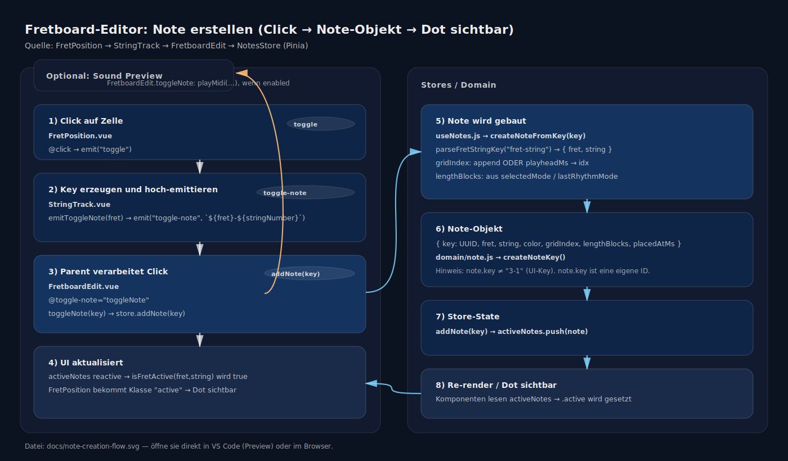

# Note erstellen im Fretboard-Editor (Diagramm)

Kurzfassung:

- Click auf `FretPosition` → `toggle`
- `StringTrack` baut den UI-Key `"fret-string"` und emittiert `toggle-note`
- `FretboardEdit.toggleNote` ruft `useNotesStore.addNote(key)` auf
- `useNotesStore.createNoteFromKey` baut das Note-Objekt und pusht in `activeNotes`
- Reaktivität → Dot wird sichtbar
